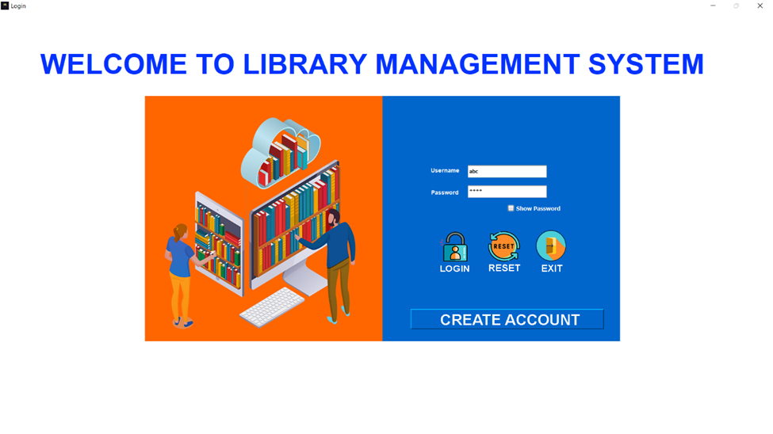
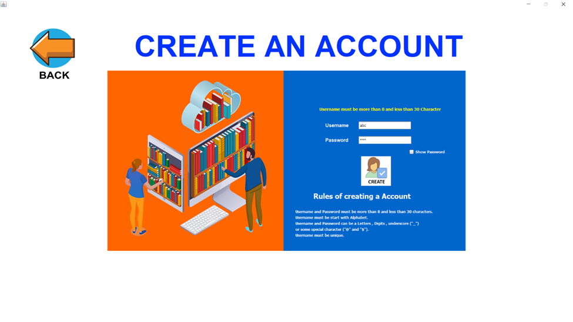
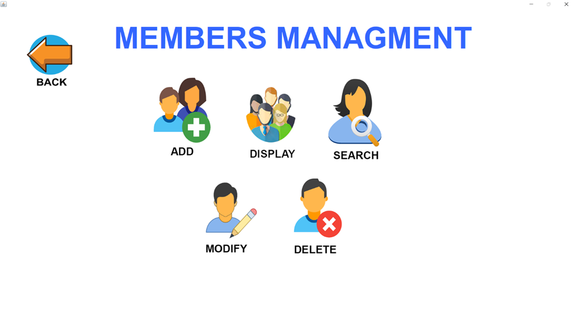
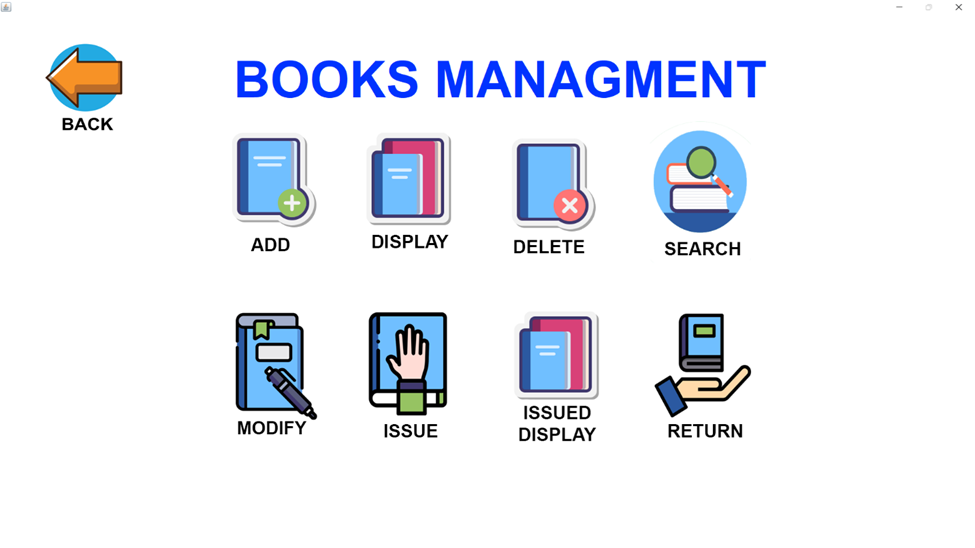
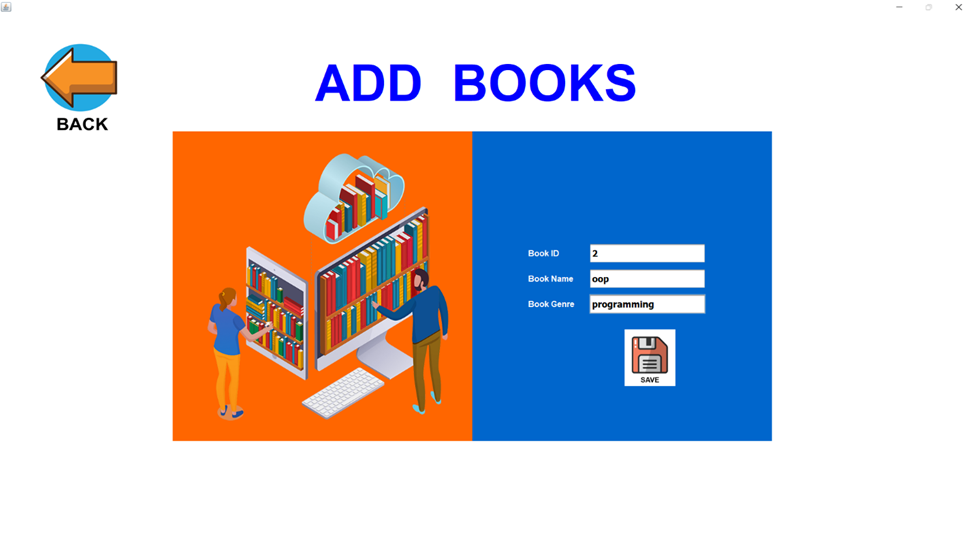
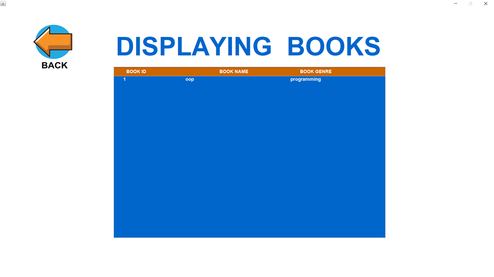
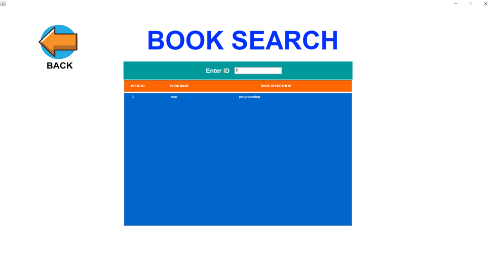
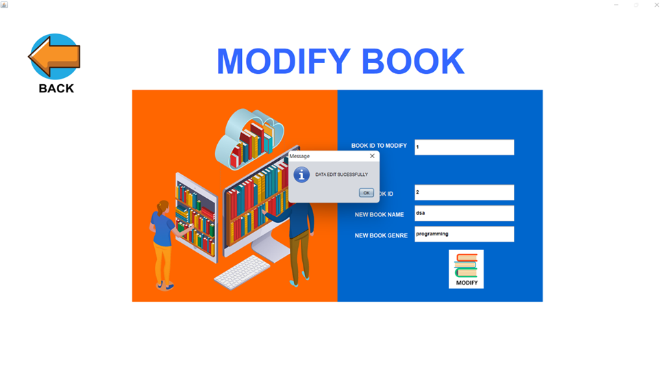
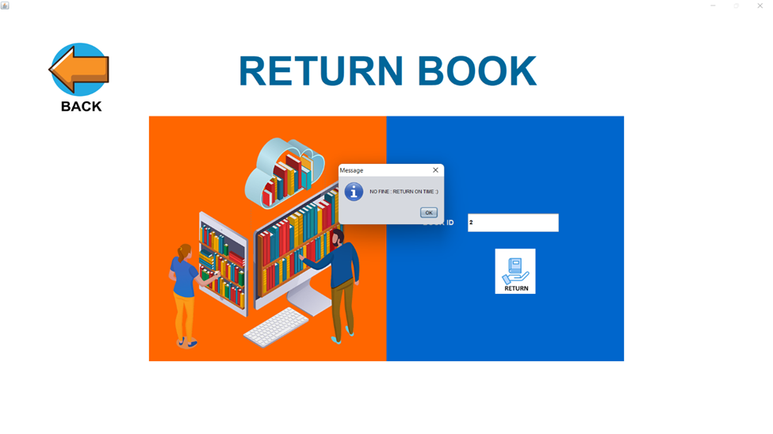

# Library Management System

A comprehensive Library Management System built with Java and NetBeans IDE.

## Overview

This system automates all library activities, including:

- Searching for books
- Adding/deleting books
- Viewing user and book details
- Issuing and returning books
- Maintaining user and book records

## Features

- User-friendly graphical user interface
- Object-oriented design using Java Serialization
- Data storage using LinkedList and filing
- Date management using LocalDate
- GUI components: JButton, JTextField, JTextArea, ActionListener, JFrame

## Requirements

- **Operating System:** Windows XP or later
- **Language:** Java
- **IDE:** NetBeans IDE
- **Storage:** 4GB RAM and 120GB ROM
- **Processor:** Intel Pentium 4 or above

## Screenshots

## Project Creator

- **Muhammad Noman**
 
## Report

[Link to project report](https://github.com/MuhammadNoman76/Library-Management-System-in-Java-using-Filing-System-and-Java-Swing/blob/main/Report/Project%20Report.docx)

## License

This project is licensed under the Apache License.

## Acknowledgments

- Java Swing

## Contributing

Contributions are welcome! Please fork this repository and submit a pull request with your changes.

## Issues

Note: Replace the placeholders (`your-username` and `your-repo-name`) with your actual GitHub username and repository name. Also, add the screenshots and report files to the repository.
